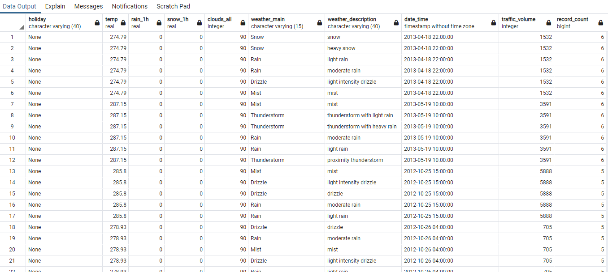
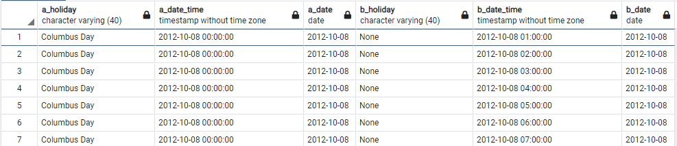
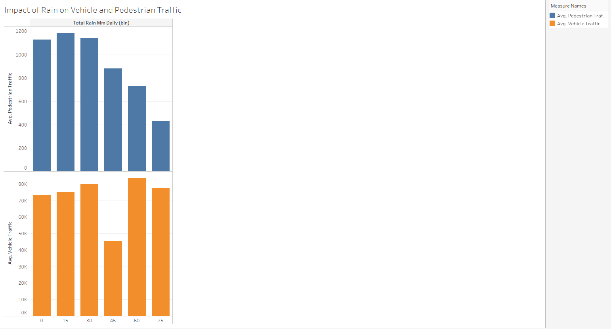
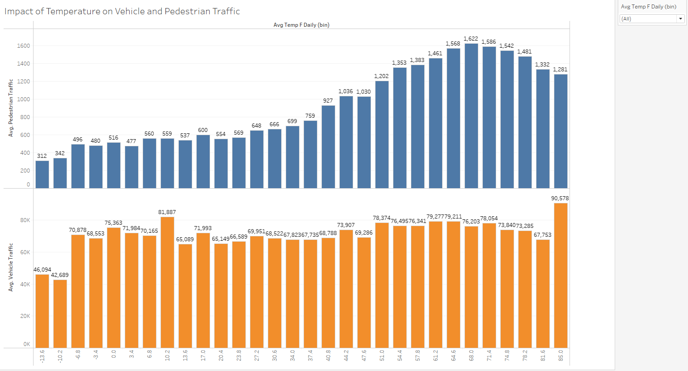

# Data_Bootcamp_Capstone_Project
Capstone project for UT Austin Data Bootcamp: Group 2

## Selected Topic:
We chose to analyze car, pedestrian, and bike traffic data collected in Ramsey County Minnesota from June 2015 to September 2018. 

## Why We Selected This Topic:
We are interested in  how weather, day of the week, time of year and holidays affected commuters’ preferred method of transportation. 

## Source of Data
Two datasets were used in our analysis. 
The first dataset contained information on hourly traffic volume, hourly weather information, and holidays.
The second dataset contained information on pedestrian traffic (bikers and walkers) on specific days. 
The original datasets can be found at the links below: 
https://archive.ics.uci.edu/ml/datasets/Metro+Interstate+Traffic+Volume#

https://www.dot.state.mn.us/bike-ped-counting/reports.html

### Vehicle Traffic Data
Our vehicle traffic dataset, compiled by the Minnesota Department of Transportation, contained hourly Westbound traffic volume for MN DoT ATR Station 301, roughly midway between Minneapolis and St. Paul, MN from October 2012 to September 2018. 

The traffic dataset contained the date, time and the number of vehicles that passed by Station 301 every hour.  

### Weather and Holiday Data
The vehicle traffic data was combined with the corresponding weather data for each hour of each day.

The weather data was obtained from OpenWeathmap, and contained information on the following: average temperature, rainfall, snowfall, cloudcover, and columns for textual descriptions of the weather. 

The holiday column contained information national holidays, plus a regional holiday (MN State Fair)

### Pedestrian Data
The pedestrian data used also came from a MN Dept. of Transportation dataset. 

This dataset contained information on walker and biker volume from all over the state of Minnesota from 2014 - 2020. It contained the number of pedestrians and bicyclists that went through checkpoints each day.

It also contained information we didn’t need for our analysis, such as the technology used to collect the data, the type of path the walkers and bikers used, and some basic weather data. 

## Questions We Hope to Answer
- How does commuter behavior change given the day of the week and time of year? 
- How do weather conditions affect commuter behavior? 
- Can we predict non-vehicle (bikers + walkers) traffic on a given day assuming vehicle traffic and weather conditions? 

## Data Exploration Phase

(See weather_traffic_db.sql in repo)

Most of the data exploration and cleaning was done in SQL.  We first dealt with duplicate datetime entries in the raw_vehicle_traffic table by dropping the textual description columns that did not provide any hard data, then averaging any disparate weather readings for a given datetime.  The image below shows samples of duplicated datetimes with identical weather data and only slightly different text weather descriptions:

We found that not all hours for a given holiday date had the the holiday listed, as seen in the query below, so we had to assure that the holidays were correctly labeled when aggregating on date.

In the raw_bike_pedestrian_traffic table, columns containing metadata such as type of bike path or technology used to track traffic were dropped.  The dataset contained data for several counties in Minnesota, so we filtered to only Ramsey County where the vehicle traffic was recorded.  The weather columns contained some null values, so we dropped those columns, since the vehicle traffic also contained weather data with no nulls.  Each date in this table had an entry for pedestrian traffic and an entry for bike traffic, so we summed those values to get a total non-vehicle traffic value for each date.

## Analysis Phase

Once the datasets had been cleaned and joined our team was able to produce initial visualizations using Seaborn. A variety of visualizations including bar charts, line graphs, scatter plots, swarm graphs, and linear regression plots allowed us to identify outliers and decide what inputs were crucial and which ones just created noise. As a second step new visualizations were created in Tableau to include in the final dashboard as well as make some of the visualizations interactive. 

## Dashboard

For our final Dashboard, we will use visualizations created with Seaborn and Tableau. Seaborn is a Python data visualization library based on matplotlib and will be used to explore the data. Data exploration will involve identifying outliers, initial patterns in the data, and identifying what variables are useful or if they just create noise for the learning model. An example of using visualizations to identify outliers can be seen below.

Tableau is a visual analytics platform that will allow us to import are final dataset and create more vibrant and complex visualizations. In Tableau we will create several interactive bar charts, line charts and scatter plots.

The interactive elements that will be used in Tableau include the ability to filter pedestrian and vehicle traffic volume by year, month, and holidays. A screen shot of one of those features can be seen below.

Tableau Link:
https://public.tableau.com/views/DraftofFinalProjectVisualizations/Vehiclevs_Non-VehicleTrafficFilteredbyMonth?:language=en-US&:display_count=n&:origin=viz_share_link

## Machine Learning Model
(See Final_Machine_Learning_Model in repo)

### Data Preprocessing and Feature Selection

After our database was connected to our machine learning model, several steps were taken to preprocess the data. In order to make the dataset more compatible with the model, we dropped the date column, as it only contained unique values. We also dropped a row that contained an extreme outlier. We grouped the entries in the 'Holiday' column into categories of either 'holiday' for any holiday and 'none' for days that were not holidays, assuming that most holidays might have a similar effect on traffic. Then we converted those labels from strings into integers so that the model could process the them. We scaled the data, and ran the machine learning model with both scaled and unscaled data. We discovered that scaling our data did not make any difference to the R-squared score in this model.

### Model Choice

We decided to use linear regression for our machine learning model. Linear regression works well in this scenario because we are attempting to predict the number of non-vehicle commuters on a given day (our target variable). This number is a continuous variable, which is what linear regression models predict. A limitation of a linear regression model is that it can only predict continuous variables. It cannot predict discreet values like a classification machine learning model. Another limitation of linear regression models is that they are especially sensitive to outliers. As stated above, we dropped our extreme outlier in order to make the model more accurate. 

### Train-Test-Split

To test the accuracy of our machine learning model, we separated our dataset into a training set with 75% of the records and a testing set the remaining 25% of records. We trained the model on the training set by giving the model both the values for the input features (rain, snow, temperature, etc.) as well as the true outcome values for Pedestrian traffic. The model used the input and output values to calculate a weighted coeffecient for each feature. We then gave the model the input features only of our testing data and had it predict the pedestrian traffic outcome by applying the coefficients to the features. Our initial model had an R-squared score of .6565 when predicting the outcomes for the testing data, meaning future data has a 65.65% chance of fitting the linear regression model.

### Model Training

#### Further Feature Engineering and Selection

After testing the initial model, we experimented with further feature engineering and selection to determine if the model's accuracy could be improved, using visualizations from the data analysis phase of the project to inform our choices. We trained the model on each new feature set in the same way as described above. We edited one feature at a time--if the score improved we maintained that change going into the next test, and if the score got worse we reverted the feature back to the previous version.

The visualizations below showed that the various weather conditions all seemed to have a noticable affect on pedestrian traffic, so we left those features in place.

While our initial hypothesis was that all holidays would effect traffic similarly, the visualizations showed that traffic varied greatly between the different holidays. So we tested the model with each holiday having its own integer value, rather the same value for all holidays as one category, which slightly improved the model's score. The visualizations also showed that pedestrian traffic levels seemed similar among all weekdays and different on weekends, so we grouped the days of the week into weekday and weekend, which also resulted in a slight improvement to the score. The visualizations showed in general that vehicle traffic remaining more constant than pedestrian traffic regardless of weather, so we tested dropping the vehicle traffic column as a feature to see if that would remove some confusion from the model. We also tested dropping the month of year column as a feature, hypothesizing that temperature was more of a key factor regardless of the month. With both vehicle traffic and month of year, the model's score worsened when these features were removed.

### R-squared Score

Our initial model test score was 65.65%. Ultimately, the model performed best when all the initial features were included, each holiday in the holiday column was left in place, and the day of week was grouped into weekday or weekend. With this feature set, the model had the highest R-squared score at .6585, meaning future data points have a 65.85 percent probability of fitting the linear regression model.

### Future Training and Testing

Each test of various feature sets only improved the model's score slightly. While we did not test every combination of features possible, the choice of feature sets was informed by trends in the data observed through the visualizations, and testing more combinations available in this data set would not likely yield a significant improvement in the model's accuracy.

To improve the model going forward beyond the scope of this project, we could obtain more records gathered from the same sorces used for this set. We could also look to add more features not available in this dataset, such as data relating to access to public transportation in the area, as that could affect how people choose to commute.

## Presentation

The link to the Presentation on Google Slides is found below: 
https://docs.google.com/presentation/d/1qK3_XEbGcECKn1S4975FJnysEMJKi50fRJiRKp0ZJbo/edit?usp=sharing

 
