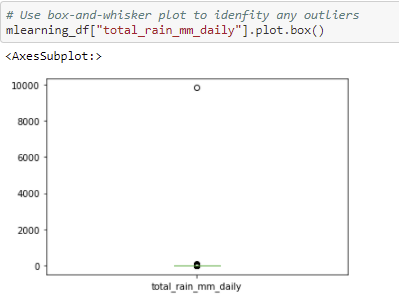
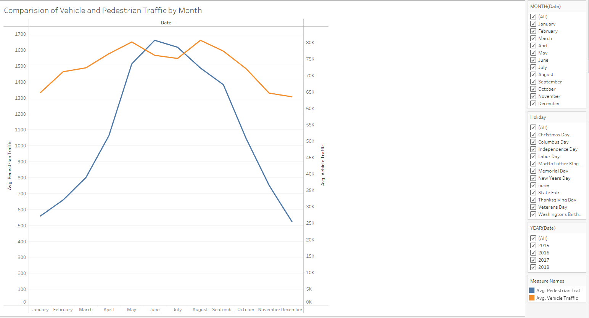

# Data_Bootcamp_Capstone_Project
Capstone project for UT Austin Data Bootcamp: Group 2

## Selected Topic:
We chose to analyze car, pedestrian, and bike traffic data collected in Ramsey County Minnesota from June 2015 to September 2018. 

## Why We Selected This Topic:
We are interested in  how weather, day of the week, time of year and holidays affected commuters’ preferred method of transportation. 

## Source of Data
Two datasets were used in our analysis. 
The first dataset contained information on hourly traffic volume, hourly weather information, and holidays.
The second dataset contained information on pedestrian traffic (bikers and walkers) on specific days. 
The original datasets can be found at the links below: 
https://archive.ics.uci.edu/ml/datasets/Metro+Interstate+Traffic+Volume#
https://www.dot.state.mn.us/bike-ped-counting/reports.html

### Vehicle Traffic Data
Our vehicle traffic dataset, compiled by the Minnesota Department of Transportation, contained hourly Westbound traffic volume for MN DoT ATR Station 301, roughly midway between Minneapolis and St. Paul, MN from October 2012 to September 2018. 

The traffic dataset contained the date, time and the number of vehicles that passed by Station 301 every hour.  

### Weather and Holiday Data
The vehicle traffic data was combined with the corresponding weather data for each hour of each day.

The weather data was obtained from OpenWeathmap, and contained information on the following: average temperature, rainfall, snowfall, cloudcover, and columns for textual descriptions of the weather. 

The holiday column contained information national holidays, plus a regional holiday (MN State Fair)

### Pedestrian Data
The pedestrian data used also came from a MN Dept. of Transportation dataset. 

This dataset contained information on walker and biker volume from all over the state of Minnesota from 2014 - 2020. It contained the number of pedestrians and bicyclists that went through checkpoints each day.

It also contained information we didn’t need for our analysis, such as the technology used to collect the data, the type of path the walkers and bikers used, and some basic weather data. 

## Questions We Hope to Answer
- How does commuter behavior change given the day of the week and time of year? 
- How do weather conditions affect commuter behavior? 
- Can we predict non-vehicle (bikers + walkers) traffic on a given day assuming vehicle traffic and weather conditions? 

## Data Exploration Phase

(See weather_traffic_db.sql in repo)

Most of the data exploration and cleaning was done in SQL.  We first dealt with duplicate datetime entries in the raw_vehicle_traffic table by dropping the textual description columns that did not provide any hard data, then averaging any disparate weather readings for a given datetime.  We found that not all hours for a given holiday date had the the holiday listed, so we had to assure that the holidays were correctly labeled when aggregating on date.

In the raw_bike_pedestrian_traffic table, columns containing metadata such as type of bike path or technology used to track traffic were dropped.  The dataset contained data for several counties in Minnesota, so we filtered to only Ramsey County where the vehicle traffic was recorded.  The weather columns contained some null values, so we dropped those columns, since the vehicle traffic also contained weather data with no nulls.  Each date in this table had an entry for pedestrian traffic and an entry for bike traffic, so we summed those values to get a total non-vehicle traffic value for each date.

## Analysis Phase

Once the datasets had been cleaned and joined our team was able to produce initial visualizations using Seaborn. A variety of visualizations including bar charts, line graphs, scatter plots, swarm graphs, and linear regression plots allowed us to identify outliers and decide what inputs were crucial and which ones just created noise. As a second step new visualizations were created in Tableau to include in the final dashboard as well as make some of the visualizations interactive. 

## Machine Learning Model
(See Balaszi_Segment2_MachineLearningModel.ipynb in repo)

### Preliminary Data Preprocessing 

After our database was connected to our machine learning model, several steps were taken to preprocess the data. In order to make the dataset more compatible with the model, we dropped the date column, as it only contained unique values.  We also dropped a row that contained an extreme outlier.  We converted the entries in the 'Holiday' column from strings into integers so that the model could process the entries. We scaled the data, and ran the machine learning model with both scaled and unscaled data. We discovered that scaling our data did not make any difference to the accuracy score in this model. 

### Preliminary Feature Engineering and Selection

As we continue to refine our model, we will experiment with the following selection methods: drop holiday columns, drop vehicle columns. For feature engineering, we will experiment with putting the rows into bins of weeks of the year, months and holidays. We will also test the model by adding a day of the week column to the dataset. We will use all of these methods to try to improve the accuracy of the model. 

### Train-Test-Split

To test the accuracy of our machine learning model, we separated our dataset into a training set and a testing set. We trained the model on the training set, which allowed the model to understand the correlation between the data points. Then we ran our testing set through the model, and asked the model to predict the number of non-vehicle commuters. Our model was able to predict the number of non-vehicle commuters with about 70% accuracy. 

### Model Choice

We decided to use linear regression for our machine learning model. Linear regression works well in this scenario because we are attempting to predict the number of non-vehicle commuters on a given day (our target variable). This number is a continuous variable, which is what linear regression models predict. A limitation of a linear regression model is that it can only predict continuous variables. It cannot predict discreet values like a classification machine learning model. Another limitation of linear regression models is that they are especially sensitive to outliers. As stated above, we dropped our extreme outlier in order to make the model more accurate. 

### Model Training

### Accuracy Score

## Dashboard

For our final Dashboard, we will use visualizations created with Seaborn and Tableau. Seaborn is a Python data visualization library based on matplotlib and will be used to explore the data. Data exploration will involve identifying outliers, initial patterns in the data, and identifying what variables are useful or if they just create noise for the learning model. An example of using visualizations to identify outliers can be seen below.

Tableau is a visual analytics platform that will allow us to import are final dataset and create more vibrant and complex visualizations. In Tableau we will create several interactive bar charts, line charts and scatter plots.

The interactive elements that will be used in Tableau include the ability to filter pedestrian and vehicle traffic volume by year, month, and holidays. A screen shot ofthose features can be seen below.

Visualization files:

Outlier.PNG

V_P_Holiday.PNG

V_P_Month.PNG

V_P_Rain.PNG

V_P_Snow.PNG

V_P_Temp.PNG

Dashboard.PNG

Tableau Link:
https://public.tableau.com/views/DraftofFinalProjectVisualizations/Vehiclevs_Non-VehicleTrafficFilteredbyMonth?:language=en-US&:display_count=n&:origin=viz_share_link

The Dashboard as of Segment 3 can be found in the repo as Dashboard.PNG

## Presentation

Our presentation as of Segment 3 can be found in the repo as Presentation.pdf

The link to the Presentation on Google Slides is found below: 
https://docs.google.com/presentation/d/1qK3_XEbGcECKn1S4975FJnysEMJKi50fRJiRKp0ZJbo/edit?usp=sharing

 
